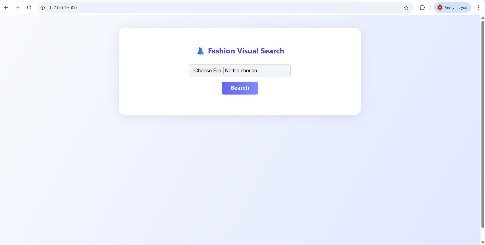

# 👗 Fashion Visual Search App

**AI-Powered Visual Search & Intelligent Styling Assistant**

---

## 🏢 Industry Context

The global fashion e-commerce market loses up to **65% of potential customers** due to the inability to find specific products. Traditional text-based search fails to describe **nuanced visual details** like color gradients, patterns, and textures that drive fashion decisions.

This system aims to bridge that gap using **Visual AI**.

---

## 🎯 Problem Statement

Build an end-to-end **machine learning system** that enables users to:

- Upload any fashion image (from social media, camera, or wardrobe)
- Receive:
  - ✅ Exact or visually similar items from inventory
  - ✅ Outfit recommendations that complement the uploaded image

---

## 🛠️ Solution Overview

This project uses:

- 🧠 **ResNet50** for image feature extraction  
- ⚡ **FAISS** for real-time similarity search  
- 🌐 **Flask** for web-based UI  
- 🗃️ **CSV & image URLs** as structured product data

Users can search by image and select from categories like jeans or dresses. The results include the product name, brand, image preview, and link to product page.

---

## 📽️ Demo Video

Watch the demo of the Fashion Visual Search App:

👉 [Click here to watch the demo](https://drive.google.com/file/d/1vmyfkwSJWBFdl3iRoSd7RVq2Co8N4BmJ/view)

---

## 🔍 Key Challenges Addressed

| Challenge                    | Solution                                                                 |
|-----------------------------|--------------------------------------------------------------------------|
| Visual Similarity at Scale  | FAISS indexing + ResNet embeddings                                       |
| Multi-Modal Understanding   | Uses metadata (brand, category) along with visual features               |
| Style Compatibility         | Category-based filtering + outfit extension (prototype)                  |
| Trend Awareness             | Dynamic data loading enables fresh recommendations                       |
| User Experience             | Mobile-friendly UI, drag & drop support, category dropdown               |

---

## 📦 Dataset Format

- `product_name`, `brand`, `description`, `category_id`, `feature_image_s3`
- `image_embeddings.npy` — vector database from ResNet50
- `products_metadata.csv` — product info for UI
- `feature_list`, `style_attributes` — optional for future enhancements

---

## ▶️ How to Run Locally

1. Install Python packages:

```bash
pip install -r requirements.txt
```

2. Start the Flask server:

```bash
python app.py
```

Server will start at: [http://127.0.0.1:5000](http://127.0.0.1:5000)

---

## 📂 Project Structure

| File/Folder             | Description                                         |
|-------------------------|-----------------------------------------------------|
| `app.py`                | Flask backend                                       |
| `data/`                 | Raw data from the problem statement                 |
| `images/`               | Product images (jeans)                              |
| `dresses_images/`       | Product images (dresses)                            |
| `templates/index.html`  | Frontend upload UI                                  |
| `image_embeddings.npy`  | Image vector index                                  |
| `products_metadata.csv` | Metadata for display                                |
| `requirements.txt`      | Python dependencies                                 |

---

## 🔁 System Workflow

1. **Image Upload (Frontend)**  
   User uploads an image via the Flask web UI  
     
   *(Try using the sample image: `sample.png`)*

2. **Image Preprocessing**  
   Resized to 224×224, normalized, and converted into a tensor.

3. **Feature Extraction (ResNet50)**  
   - Output: 2048-dim vector
   - Captures features like color, texture, shape.

4. **Similarity Search (FAISS)**  
   - Pre-indexed embeddings are searched.
   - Returns Top 5 visually similar products using L2 distance.

5. **Product Matching**  
   Each result includes:
   - `product_name`
   - `brand`
   - Image URL (preview)
   - `pdp_url` (Product Detail Page)

6. **Display Results (Frontend)**  
   Shows the original image and Top 5 matching products.

---

## 🔄 Regenerating Embedding Files

⚠️ The following large files are **excluded** from the repository:

- `image_embeddings.npy`
- `dresses_image_embeddings.npy`

You can regenerate them locally by running:

```bash
python gen.py        # For image_embeddings.npy
python dress.py      # For dresses_image_embeddings.npy
```
